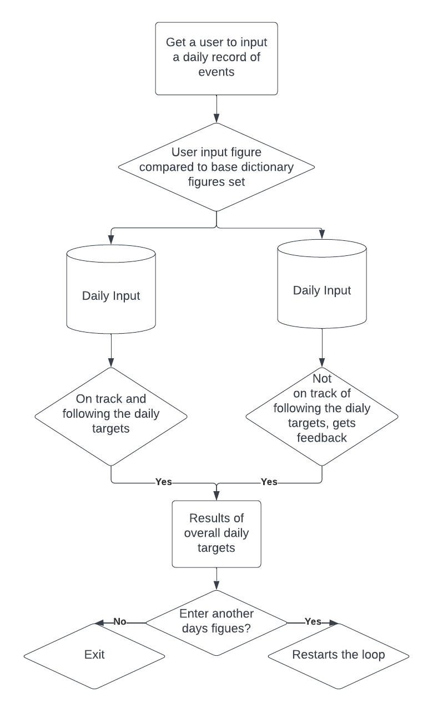
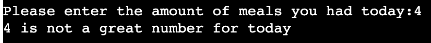
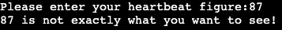
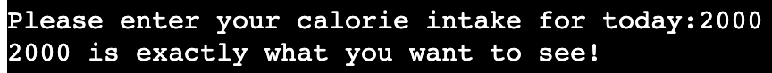
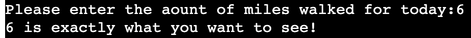
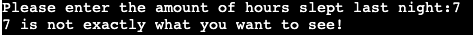
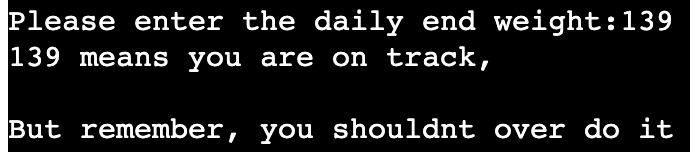

# HEXAHEALTH
Hexahealth is a inline command run diary where it compares a users entry against an already placed database set by a program before hand. The aim is to make daily entries to see how you got on through the previous 24 hour period against what the program sets you.  
<a href="https://hexahealth.herokuapp.com/">Link to my deployed project</a>

 

<h2>Table of Contents</h2>
  <ol>
  <li>Flowchart</li>
   
  <li>User Experience</li>
   
  <li>Features</li>
   
   <li>Data Handling</li>
   
  <li>Data Model</li>
   
  <li>Testing</li>
   
  <li>Bugs</li>
   
   <li>Other Resources Used</li>
   
  <li>Deployed</li>
   
  <li>Credits</li>
   
  </ol>
  

  <h3>Flowchart</h3>
   
  
  
I used Lucid Chart to produce a simple flow chart demonstrating the flow of the program

   
  
  <h3>User Experience</h3>
  <h4> User Story</h4>
    <ul>
      <li>Wants to stick to a regime for health reasons</li>
      <li>Tells user that there are limits for certain criteria</li>
      <li>Starts to input data for instant feedback against the base data</li>
      <li>If the data is on or inside the guided data then feedback is printed to the console in a positive manor</li>
      <li>If the data is over the guided data then then feedback is printed to advise to follow the set figures for the program</li>
      <li>Once completed user exits or starts again</li>
  </ul>
   
  <h4>Project Goals</h4>
  <ul>
    <li>Provide some information feedback relating to a guidance already in place within the program</li>
    <li>Learn where a user can improve against the values within the program</li>
  </ul>
 

  
  <h3>Instructions/Run Through</h3>
    
At first you already know what the program involves being a health program. You get a set list if questions which are:
 
   
  
The first one shows how many meals a user has, the value comparisonis built in to the program for instant feedback.

   
   
  
The next qestion asks a user their heartbeat at resting for the day

   
   
  
The next qestion asks a user their number of calories against the standard diary within the program

   
   
  
The next qestion asks a user their number of miles walked against the value in the program

   
   
  
The next qestion asks a user their number of hours slept compared to the value in the program

   
   
  
The last qestion asks a user their end of their day weight to see if there has been any improvement.

   
  
  <h3>Bugs</h3>
  <h4>Deployment of start paragraph<h4>
  
Unfortunately I didnt manage to get the start print statements to apply themselves before the questions come up, its something that really dissapointed myself in this project but for various reasons outside of this I just havnent had the chance to keep trying

   
  <h4>Final colletive data</h4>
  
Althought I have been scrolling google and stack overflow I havent been able to recreate a way to output the data at the end as one collective data. Again because of lack of time and issues away from from this course it simply hasnt been doable, and for this I am gutted to be honest.
 
  <h4>Heartbeat result</h4>
  
For some reason a user input always comes out neagtive for this question which I simply can not find out why, something to dive into deeper another time

     <h4>Background image for index page on browser<h4>
      
I have added it in exactly how someone else has but for some reason my image doesnt want to show when loaded, another thing that has baffled me

        
       

  
   
       <h3>Features to Add</h3>
       <ul>
       <li>Add the ability to share your details before questionaire and add a personal response to the program</li>
       <li>Be able to output final data in a collective way from a dictionary and for it to be a bit more fun, not sure how yet but getting it working first would be helpful</li>
       </ul>
       
  

          
       <h3>Data Handling</h3>
        
 In this project the data that a user gets compared to is set in a dictionary. Any additional questions and comparison values can be added the code and applied easily if more data was required

        
       <h3>Deployment</h3>
       
       Deployment was done at the start of the project to allow device testing throughout the development process.

       
My project was deployed via Heroku as follows:

       <li>Remove un-used imports from run.py file.</li>
        <li>In order for input methods to work properly in the deployed mock terminal, add a new line character at the end of the text, inside the input method.</li>
        <li>If required, create list of requirements with the following command in the terminal: pip3 freeze > requirements.txt</li>
        <li>In Heroku account, go to Dashboard and click ‘Create New App’. Give the app a unique name and select region (Europe).</li>
        <li>Click ‘Create App’.<li>
        <li>Go to Settings tab and set up Config Vars (only required if using a creds.json file).</li>
       <li>Click ‘Add Buildpack’, select Python and click ‘Save Changes’.</li>
        <li>Then select ‘NodeJS’ and click save again. IMPORTANT - Buildpacks should be in order. Python on top of NodeJS.<li>
       <li>Click on ‘Deploy’ tab.</li>
       <li>Select ‘GitHub' as deployment method.</li>
       <li>Search for repo name and connect.</li>
       <li>Click ‘Enable Automatic Deploys’.</li>
        <li>Ensure that ‘main’ branch is selected in Manual deploy section and click ‘Deploy Branch’.</li>
       <li>Once deployed, click ‘view’ to access deployed project.</li>
        
